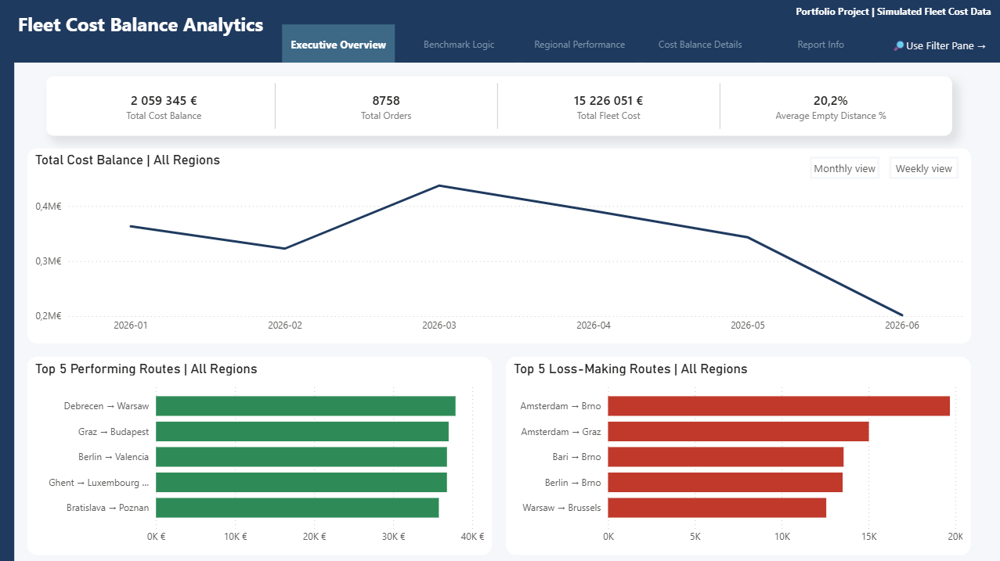
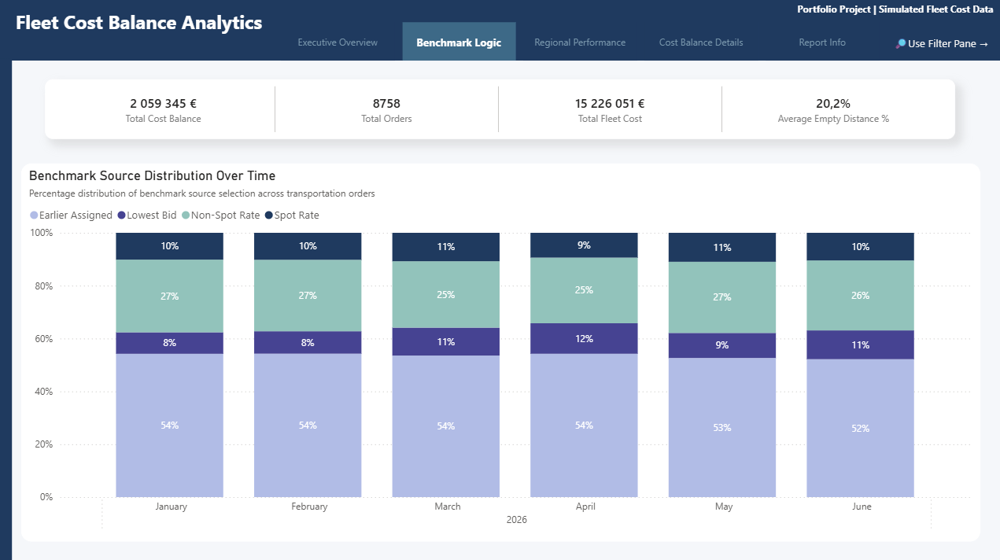
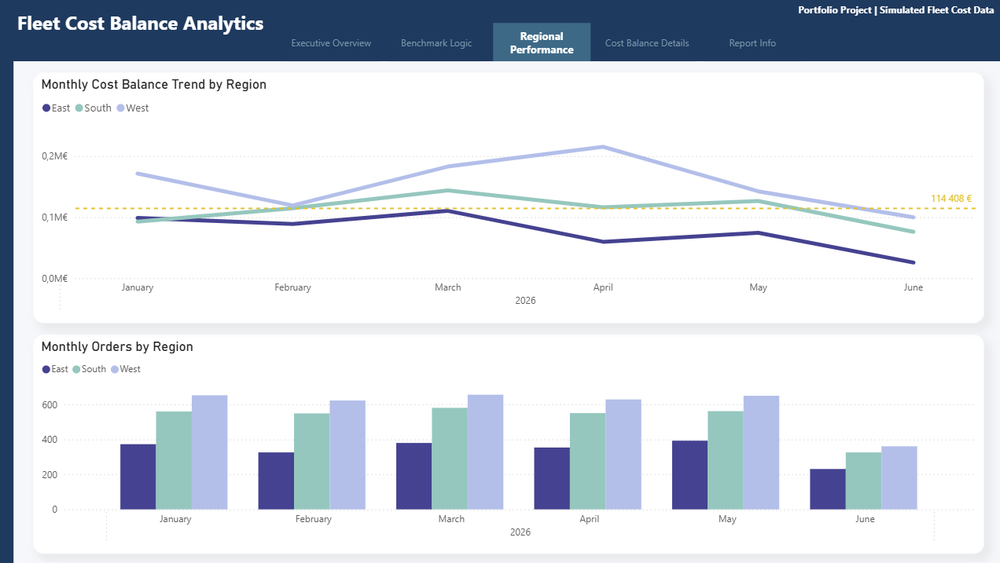
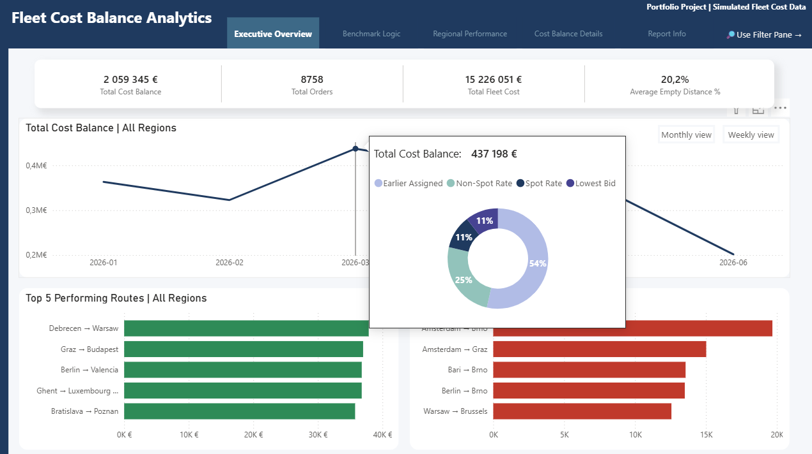

# Fleet Cost Balance Analytics

Simplified enterprise-inspired transportation cost benchmarking and operational analytics project built with Power BI and SQL.

## Business Problem

The project focuses on evaluating the real financial impact of internal fleet execution by comparing actual fleet transportation costs against realistic alternative carrier cost scenarios.

Traditional benchmarking approaches often compared fleet execution costs against the cheapest contracted carrier available on a given route, which significantly overstated operational losses.

This project introduces a rule-based benchmark selection engine that dynamically identifies the most realistic alternative transportation cost depending on operational conditions such as:

- Earlier Assigned Carrier Costs
- Lowest Spot Bids
- Spot Rates
- Non-Spot Rates
- Rank 1 Carrier Costs

## Key Features

## Business Logic & Benchmarking
- Rule-based benchmark selection engine
- Transportation cost benchmarking logic
- Fallback benchmark hierarchy
- Operational benchmark prioritization
- Business rule documentation layer

## Data & Modeling
- Power BI semantic model
- SQL preprocessing layer
- Star schema data model
- DAX calculation layer
- Power Query transformations

## Reporting & Analytics
- Executive operational overview
- Transportation KPI analysis
- Regional performance monitoring
- Route profitability analysis
- Operational drillthrough pages
- Interactive tooltip reporting
- Monthly and weekly trend analysis
- Bookmark-based navigation
- Filter pane optimization

## Tech Stack

- Power BI
- SQL
- Power Query
- DAX
- Snowflake
- SAP

## Planned Project Structure

```txt
fleet-cost-balance-analytics/
├── sql/
├── powerbi/
├── screenshots/
├── data_model/
└── docs/

## Planned Project Structure

```txt
fleet-cost-balance-analytics/
├── sql/
├── powerbi/
├── screenshots/
├── data_model/
└── docs/
```

## Report Preview

### Executive Overview



### Benchmark Logic



### Regional Performance



### Interactive Tooltip Example



### Data Model


