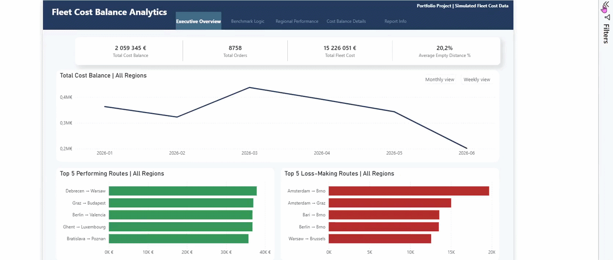

# Fleet Cost Balance Analytics

Power BI | SQL | DAX | Data Modeling | Power Query | Snowflake | SAP

Simplified enterprise-inspired transportation cost benchmarking and operational analytics project built with Power BI and SQL.

## Business Problem

The project focuses on evaluating the real financial impact of internal fleet execution by comparing actual fleet transportation costs against realistic alternative carrier cost scenarios.

Traditional benchmarking approaches compared fleet execution costs against the cheapest contracted carrier available on a given route, which significantly overstated operational losses.

This project introduces a rule-based benchmark selection engine that dynamically identifies the most realistic alternative transportation cost depending on operational conditions.

The analysis helps identify:

- real fleet profit and loss performance
- the most and least profitable transportation routes
- orders with significant cost deviations
- tendering inefficiencies
- carrier cost optimization opportunities


## Data Flow

SAP & Snowflake → SQL → Data Modeling → Power BI → DAX Measures → Business Insights


## Business Logic & Benchmarking
- Rule-based benchmark selection engine
- Transportation cost benchmarking
- Business rule documentation

## Data & Modeling
- SQL preprocessing layer
- Power Query transformations
- Power BI semantic model
- DAX calculation layer

## Reporting & Analytics
- Executive operational overview
- Transportation KPI analysis
- Regional performance monitoring
- Route profitability analysis
- Operational drillthrough pages
- Interactive tooltip reporting
- Monthly and weekly trend analysis
- Bookmark-based navigation
- Filter pane optimization

## Project Structure

```txt
fleet-cost-balance-analytics/
├── data/
├── sql/
├── powerbi/
├── screenshots/
└── docs/
```

## Report Preview



Additional dashboard screenshots, tooltip examples, drillthrough views, SQL transformation samples, and business logic documentation are available in the corresponding project folders:

- [`/screenshots`](./screenshots) — dashboard pages, tooltips, and drillthrough examples
- [`/sql`](./sql) — sanitized SQL transformation logic and benchmark calculations
- [`/docs`](./docs) — DAX logic, business rules, and data dictionary
- [`/data`](./data) — simulated datasets used for the portfolio version
- [`/powerbi`](./powerbi) — Power BI project files


## Repository Notes

The Power BI report included in this repository uses fully anonymized and simulated data created for portfolio purposes.
